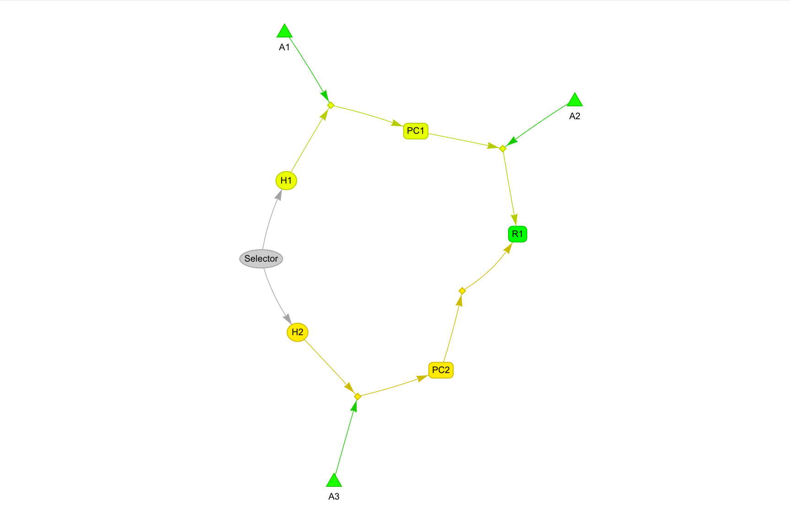

# ExplanatoryGraph

A framework for constructing and analyzing explanatory accounts—structured representations of how hypotheses explain evidence with the help of intermediate claims and background assumptions. Enables assessment of competing hypotheses through their full explanatory pathways using Bayesian network inference. Includes an interactive Shiny application for model building, visualization, and analysis.



## Documentation

- **New to explanatory accounts?** Read the [Quick Primer](docs/primer.md)
- **See it in action:** Explore the [COVID-19 Case Study](docs/covid19_case_study_overview.md)
- **Ready to build a model?** See the [Tutorial](docs/tutorial.md)

## Overview

The Explanatory Accounts Framework helps you:
- **Build explanatory models of the full evidence base** with competing hypotheses and their auxiliary claims
- **Run Bayesian inference** to compute posterior probabilities over the full network
- **Identify high-value research targets** by computing which uncertainties, if resolved, would most reduce uncertainty about the hypotheses

## Quick Start

### Installation

```bash
git clone https://github.com/blue-eclectus/ExplanatoryGraph.git
cd ExplanatoryGraph
```

```r
# Install all dependencies (including Bioconductor packages)
source("R/package_utils.R")
install_dependencies()
```

### Launch the App

```r
source("R/package_utils.R")
run_app()

# Or directly:
shiny::runApp(".")
```

The app opens in your browser with a step-by-step wizard for building models.

### Try a Case Study

In the app sidebar, click **"Load Simple Test"** or **"Load COVID-19 Example"** to explore a pre-built model.

## Programmatic Usage

Use the framework directly in R scripts:

```r
# Load the framework (from project root)
source("R/classes.R")
source("R/bayesian_spec_classes.R")
source("R/explanatory_classes.R")
source("R/explanatory_network.R")
source("R/explanatory_case_study.R")
source("R/bayesian_spec_cpt.R")
source("R/bayesian_spec_inference.R")

# Load a pre-built case study
model <- create_simple_test_case_study()

# Or build your own model
model <- ExplanatoryModel$new(name = "My Analysis")

# Add hypotheses (priors must sum to 1.0)
model$add_hypothesis(BayesianHypothesis$new(
  id = "H1", text = "Theory 1", source = "User", prior = 0.5
))
model$add_hypothesis(BayesianHypothesis$new(
  id = "H2", text = "Theory 2", source = "User", prior = 0.5
))

# Add results (evidence corpus)
model$add_result(BayesianResult$new(
  id = "R1", text = "Key observation", source = "Study 2024"
))

# Build accounts and explanatory chains...
# (See R/explanatory_case_study.R for complete examples)

# Build network and run inference
graph <- build_bayesian_network(model)
cpts <- generate_all_cpts_spec(graph)
posteriors <- compute_posteriors(graph, cpts, list(R1 = "true"))

# View results
posteriors$H1  # Posterior distribution for H1
posteriors$H2  # Posterior distribution for H2
```

## Features

### Interactive App

- **Network visualization** with multiple color modes
- **Step-by-step builder** for model construction
- **Analysis tools** for explanatory account graphs, including Bayesian network inference

### Framework

The project implements a formal framework based on contemporary philosophy of science for representing explanatory accounts with defined node types (hypotheses, accounts, phenomena, auxiliaries, results) and their relationships. See the [Primer](docs/primer.md) for conceptual details.

## Project Structure

```
ExplanatoryGraph/
├── app.R                 # Shiny application
├── www/                  # Static files (CSS)
│   └── custom.css
├── R/                    # Source code
│   ├── classes.R
│   ├── bayesian.R
│   ├── bayesian_spec_classes.R
│   ├── bayesian_spec_cpt.R
│   ├── bayesian_spec_inference.R
│   ├── explanatory_classes.R
│   ├── explanatory_network.R
│   ├── explanatory_case_study.R
│   ├── voi_analysis.R
│   ├── sensitivity_analysis.R
│   ├── probability_viz_helpers.R
│   ├── cpt_utils.R
│   ├── conversion.R
│   └── package_utils.R
├── tests/                # Test suite
│   ├── testthat/
│   └── *.R               # Unit and integration tests
└── docs/                 # Documentation
    ├── primer.md
    ├── tutorial.md
    └── covid19_case_study_overview.md
```

## Testing

```r
# Run all test files (from project root)
for (f in list.files("tests", pattern = "^test.*\\.R$", full.names = TRUE)) source(f)

# Or run testthat tests only
testthat::test_dir("tests/testthat")
```

## License

MIT License

## Links

- **GitHub Repository**: https://github.com/blue-eclectus/ExplanatoryGraph
- **Issues & Feedback**: https://github.com/blue-eclectus/ExplanatoryGraph/issues
