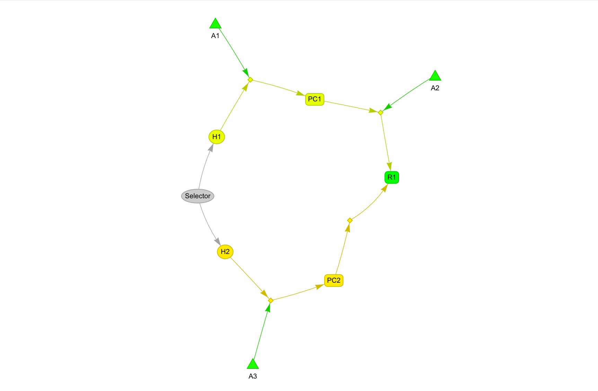

# ExplanatoryGraph

ExplanatoryGraph offers a framework for representing the explanatory relationships linking hypotheses to empirical results. Hypotheses rarely explain empirical results in isolation---they usually require various intermediate claims and background assumptions. Recognizing the full explanatory structure can be crucial for reliably assessing hypotheses. The framework provided here enables Bayesian network inference on the full explanatory structure. Through an interactive Shiny app or R scripting, users can build their own explanatory graphs, run Bayesian inference, and visualize results.



## Documentation

- **New to explanatory accounts?** Read the [Quick Primer](docs/primer.md)
- **See it in action:** Explore the [COVID-19 Case Study](docs/covid19_case_study_overview.md)
- **Ready to build a model?** See the [Tutorial](docs/tutorial.md)

## Features

ExplanatoryGraphs can help you do the following:
- **Build explanatory models of the full evidence base** with competing hypotheses
- **Run Bayesian inference** to compute posterior probabilities over the full network
- **Identify high-value research targets** by computing which uncertain claims, if resolved, would most reduce uncertainty about the hypotheses

### Framework

The project implements a formal framework based on contemporary philosophy of science for representing explanatory graphs with defined node types (hypotheses, accounts, phenomena, auxiliaries, results) and their relationships. See the [Primer](docs/primer.md) for conceptual details.

## Quick Start

### Installation

```bash
git clone https://github.com/blue-eclectus/ExplanatoryGraph.git
cd ExplanatoryGraph
```

```r
# Install all dependencies (including Bioconductor packages)
source("R/package_utils.R")
install_dependencies()
```

### Launch the App

```r
source("R/package_utils.R")
run_app()

# Or directly:
shiny::runApp(".")
```

The app opens in your browser with a step-by-step wizard for building models.

### Try a Case Study

In the app sidebar, click **"Load Simple Test"** or **"Load COVID-19 Example"** to explore a pre-built model.

## Programmatic Usage

Use the framework directly in R scripts:

```r
# Load the framework (from project root)
source("R/classes.R")
source("R/bayesian_spec_classes.R")
source("R/explanatory_classes.R")
source("R/explanatory_network.R")
source("R/explanatory_case_study.R")
source("R/bayesian_spec_cpt.R")
source("R/bayesian_spec_inference.R")

# Load a pre-built case study
model <- create_simple_test_case_study()

# Or build your own model
model <- ExplanatoryModel$new(name = "My Analysis")

# Add hypotheses (priors must sum to 1.0)
model$add_hypothesis(BayesianHypothesis$new(
  id = "H1", text = "Theory 1", source = "User", prior = 0.5
))
model$add_hypothesis(BayesianHypothesis$new(
  id = "H2", text = "Theory 2", source = "User", prior = 0.5
))

# Add results (evidence corpus)
model$add_result(BayesianResult$new(
  id = "R1", text = "Key observation", source = "Study 2024"
))

# Build accounts and explanatory chains...
# (See R/explanatory_case_study.R for complete examples)

# Build network and run inference
source("R/app_helpers.R")
graph <- build_bayesian_network(model)
selector <- Selector$new(model)
cpts <- generate_all_cpts_for_model(model, graph, selector)
posteriors <- compute_posteriors(graph, cpts, list(R1 = "true"))

# View results
posteriors$H1  # Posterior distribution for H1
posteriors$H2  # Posterior distribution for H2
```

## Testing

```r
# Run all test files (from project root)
for (f in list.files("tests", pattern = "^test.*\\.R$", full.names = TRUE)) source(f)

# Or run testthat tests only
testthat::test_dir("tests/testthat")
```

## License

MIT License

## Links

- **GitHub Repository**: https://github.com/blue-eclectus/ExplanatoryGraph
- **Issues & Feedback**: https://github.com/blue-eclectus/ExplanatoryGraph/issues
